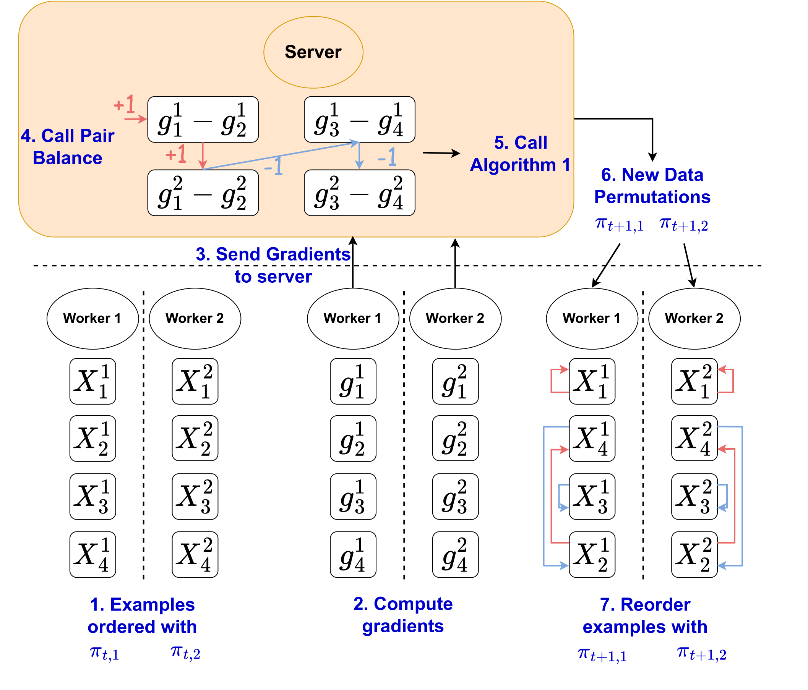

# CD-GraB: Coordinating Distributed Example Orders for Provably Accelerated Training
[](https://opensource.org/licenses/Apache-2.0)

CD-GraB aims to find a distributed data permutation with provably better convergence guarantees than Distributed Random Reshuffling (D-RR). Our paper can be found [https://arxiv.org/abs/2302.00845](https://arxiv.org/abs/2302.00845).



# Requirements
Python >= 3.9
PyTorch >= 2.0.0
CUDA >= 11.7 on linux
torchopt
torchvision
functorch
transformers

# Experiments

#### All generated plots in the paper can be found under notebooks directory.


## Logistic regression on HMDA
Please run the following command for `CD-GraB`
```
torchrun --nproc_per_node=4 --nnodes=1 --master_addr="localhost" --master_port=35500 main-LR-HMDA.py --sorter CD-GraB --seed 0 --lr 5e-3 --node_cnt 4
```

and the following command for `D-RR`
```
torchrun --nproc_per_node=4 --nnodes=1 --master_addr="localhost" --master_port=35500 main-LR-HMDA.py --sorter D-RR --seed 0 --lr 5e-3 --node_cnt 4
```

## LSTM on Wiki2

Please run the following command for `CD-GraB`
```
torchrun --nproc_per_node=4 --nnodes=1 --master_addr="localhost" --master_port=35500 main-LSTM-Wiki2.py --sorter CD-GraB --seed 0 --lr 5.0 --B 16 --node_cnt 4
```

and the following command for `D-RR`
```
torchrun --nproc_per_node=4 --nnodes=1 --master_addr="localhost" --master_port=35500 main-LSTM-Wiki2.py --sorter D-RR --seed 0 --lr 5.0 --B 16 --node_cnt 4
```


## Autoregressive MLP on M4

Please run the following command for `CD-GraB`
```
torchrun --nproc_per_node=4 --nnodes=1 --master_addr="localhost" --master_port=35500 main-MLP-M4.py --sorter CD-GraB --seed 0 --B 32 --epochs 50 --node_cnt 32
```

and the following command for `D-RR`
```
torchrun --nproc_per_node=4 --nnodes=1 --master_addr="localhost" --master_port=35500 main-MLP-M4.py --sorter D-RR --seed 0 --B 32 --epochs 50 --node_cnt 32
```


## Tiny GPT2 pretraining on WikiText-103
Please run the following command for `CD-GraB`
```
python main-GPT2-Wiki103.py --sorter CD-GraB --seed 0
```

and the following command for `D-RR`
```
python main-GPT2-Wiki103.py --sorter D-RR --seed 0
```


# Authors
 - [Wentao Guo](http://wentaoguo.me/), wg247@cornell.edu
 - [A. Feder Cooper](https://afedercooper.info/), afc78@cornell.edu
 - [Khiem Pham](https://scholar.google.com/citations?user=NSkcWG0AAAAJ&hl=en), dkp45@cornell.edu
 - [Yucheng Lu](https://www.cs.cornell.edu/~yucheng/), yl2967@cornell.edu
 - Tiancheng Yuan, ty373@cornell.edu 
 - Charlie F. Ruan, cfr54@cornell.edu
 - [Christopher De Sa](https://www.cs.cornell.edu/~cdesa/), cdesa@cs.cornell.edu


# License
CD-GraB uses Apache-2 license in the [LICENSE](https://github.com/GarlGuo/CD-GraB/blob/main/LICENSE) file.


# Cite us

If you find CD-GraB helpful in your research, please consider citing us:

```
@misc{cooper2023cdgrab,
      title={CD-GraB: Coordinating Distributed Example Orders for Provably Accelerated Training}, 
      author={A. Feder Cooper and Wentao Guo and Khiem Pham and Tiancheng Yuan and Charlie F. Ruan and Yucheng Lu and Christopher De Sa},
      year={2023},
      eprint={2302.00845},
      archivePrefix={arXiv},
      primaryClass={cs.LG}
}
```